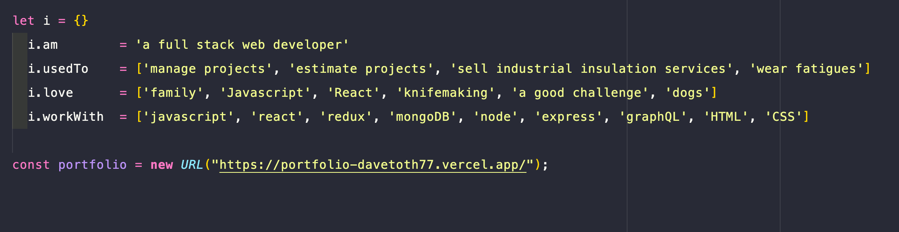

 

##### Hey there 👋

I'm Dave, a Full Stack Web Developer that has skills in both front and back end applications. I enjoy using innovative techniques as well as a strong attention to detail to get a project done with the clients expectations not only met, but exceeded. I seek a role as a web developer at a company where I can learn, grow, and continue to master the craft.

Want to know more about me? [Check out my portfolio.](https://portfolio-davetoth77.vercel.app/)

## 📩 Latest Blog Posts

 

<!-- BLOG-POST-LIST:START -->

<!-- BLOG-POST-LIST:END -->

 

## 📌 Pinned Repositories

 

 

 

 

## 💼 Skills

